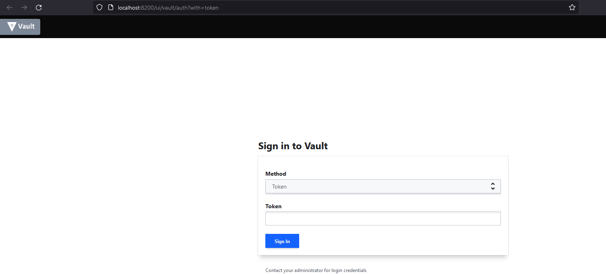
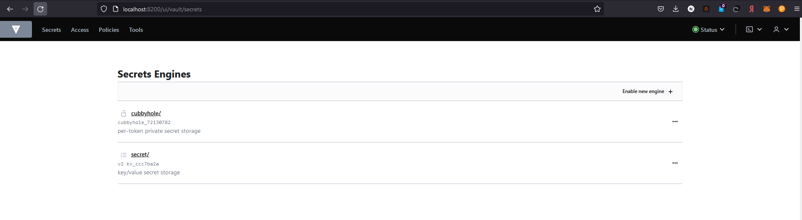
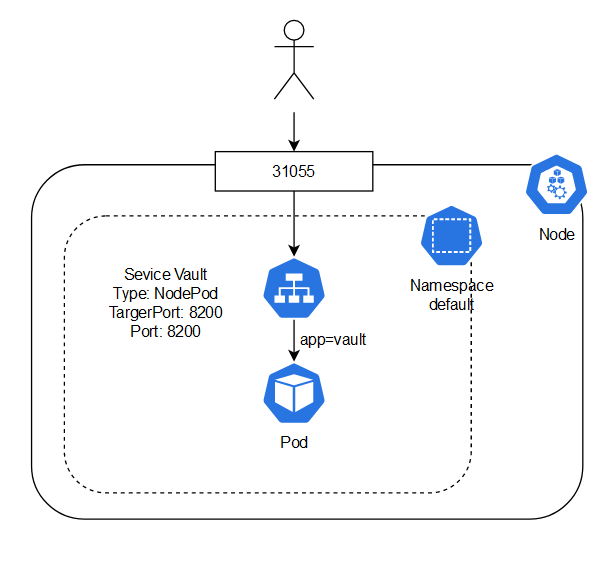

# Лабораторная работа №1 "Установка Docker и Minikube, мой первый манифест."

## Общая информация

University: [ITMO University](https://itmo.ru/ru/)

Faculty: [FICT](https://fict.itmo.ru)

Course: [Introduction to distributed technologies](https://github.com/itmo-ict-faculty/introduction-to-distributed-technologies)

Year: 2022/2023

Group: K4110C

Author: Nikolaev Vladislav Igorevich

Lab: Lab1

Date of create: 29.10.2022

Date of finished:

## Ход работы

### Запуск кластера minikube

Для создания кластера minikube была использована следующая команда:
```bash
$ minikube start --driver=docker --kubernetes-version=v1.25.2
```

Данная команда использует Docker в качестве драйвера для запуска Kubernetes кластера. После создания кластера, необходимо проверить возможность подключения к нему.


### Запуск пода в Kubernetes кластере

После запуска кластера и проверки подключения, был создан манифест [pod.yaml](pod.yaml). Для развертывания пода была использована следущая команда:

```bash
$ kubectl apply -f pod.yaml
```

Убедимся, что pod стартовал успешно:

```bash
$ kubectl get pod

# Output
NAME    READY   STATUS    RESTARTS   AGE
vault   1/1     Running   0          46s
```

### Создание сервиса

Для обеспечения доступа к поду, был создан сервис `vault` типа NodePort:
```bash
$ minikube kubectl expose pod vault --type NodePort --port 8200
```

### Получение доступа к контейнеру

```bash
minikube kubectl port-forward  svc/vault 8200:8200
```

Данная команда пробрасывает порт хоста в контейнер Vault. После выполнения данной команды, приложение будет доступно по адресу `http://localhost:8200`.



###  Получение токена для доступа в Vault

Получим логи контейнера с помощью команды и отфильтруем их с помощью утилиты grep:
```bash
$ minikube kubectl logs vault  | grep Token

# Output
Root Token: hvs.UA70vBwW67vuKAH2fr0RKDua
```

Вставим найденный токен в форму авторизации на странице приложения. При успешной авторизации откроется главная страница приложения Vault:


### Схема организации контейнеров и сервисов


