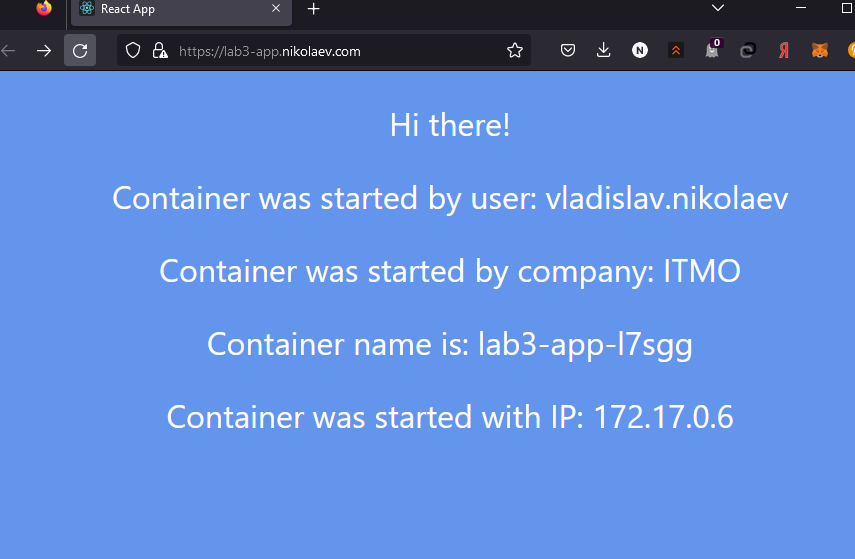
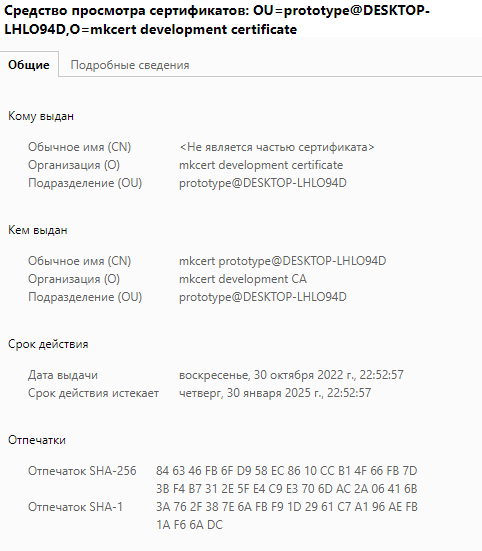

# Лабораторная работа №3 "Сертификаты и "секреты" в Minikube, безопасное хранение данных."

## Общая информация

University: [ITMO University](https://itmo.ru/ru/)

Faculty: [FICT](https://fict.itmo.ru)

Course: [Introduction to distributed technologies](https://github.com/itmo-ict-faculty/introduction-to-distributed-technologies)

Year: 2022/2023

Group: K4110C

Author: Nikolaev Vladislav Igorevich

Lab: Lab3

Date of create: 18.11.2022

Date of finished:

## Ход работы

### Создание ConfigMap

ConfigMap позволят определять конфигурационные файлы и переменные, которые потом могут использоваться контейнерами с приложениями. Таким образом, ConfigMap избавляет от необходимости упаковывать конфиги в docker-образ.

Манифест configMap для приложения находится в файле [configmap.yaml](configmap.yaml).

Создание ConfigMap `lab3-app-cm`:

```bash
kubectl apply -f configmap.yaml -n lab3
```

### Передача значений ConfigMap в ReplicaSet

Для развертывания приложения был создан манифест [replicaset.yaml](replicaset.yaml). Для передачи значений ConfigMap в контейнер в качестве переменных окружений используется поле envFrom с указанием имени созданного ConfigMap.

Также был создан манифест [service.yaml](service.yaml), описывающий сервис типа ClusterIP для доступа к подам приложения lab3-app.

Развертывание ReplicaSet и Service:
```bash
$ kubectl apply -f replicaset.yaml -n lab3
$ kubectl apply -f service.yaml -n lab3
$ kubectl get all -n lab3

# Output:
NAME                 READY   STATUS    RESTARTS   AGE
pod/lab3-app-6xdlt   1/1     Running   0          13s
pod/lab3-app-l7sgg   1/1     Running   0          13s

NAME               TYPE        CLUSTER-IP     EXTERNAL-IP   PORT(S)   AGE
service/lab3-app   ClusterIP   10.110.84.67   <none>        80/TCP    6s

NAME                       DESIRED   CURRENT   READY   AGE
replicaset.apps/lab3-app   2         2         2       13s
```

### Развертывание ingress-controller и создание TLS сертификата

Ingress Controller представляет собой специальный балансировщик нагрузки для Kubernetes. Ingress controller позволяет принимать траффик извне кластера и направлять его на поды.

В данной работе был развернут Nginx Ingress controller:

```bash
$ kubectl apply -f https://raw.githubusercontent.com/kubernetes/ingress-nginx/controller-v1.0.0/deploy/static/provider/cloud/deploy.yaml
```

После развертывания ingress controller в неймспейсе ingress-nginx появился сервис типа LoadBalancer - `ingress-nginx-controller`. Именно через этот сервис будет проходить входящий траффик. Траффик будет распределяться на поды, согласно правилам, которые будут описаны объектами Ingress.

```bash
$ kubectl get svc -n ingress-nginx

# Output:
NAME                                 TYPE           CLUSTER-IP      EXTERNAL-IP   PORT(S)                      AGE
ingress-nginx-controller             LoadBalancer   10.108.35.175   127.0.0.1     80:32669/TCP,443:30301/TCP   16s
ingress-nginx-controller-admission   ClusterIP      10.105.15.185   <none>        443/TCP                      16s
```

Для генерации TLS-сертификата была использована утилита `mkcert`:

```bash
$ mkcert nikolaev.com "*.nikolaev.com" localhost 127.0.0.1
```

Далее TLS-сертификат необходимо импортировать в кластер в виде секрета (Secret):

```bash
$ kubectl create secret tls tls-cert --key key.pem --cert cert.pem -n lab3
```

### Создание Ingress в minikube

В файле [ingress.yaml](ingress.yaml) приведен манифест Ingress, который описывает dns-имена и правила распределения траффика на поды.

Создание ingress:
```bash
$ kubectl apply -f ingress.yaml -n lab3

$ kubectl get ingress

# Output:
NAME       CLASS    HOSTS                   ADDRESS   PORTS     AGE
lab3-app   nginx   lab3-app.nikolaev.com             80, 443   24s
```


### Получение доступа к приложению через FQDN

Для получения доступа к сервису `ingress-nginx-controller` необходимо запустить туннель minikube:

```bash
$ minikube tunnel
```

Чтобы приложение lab3-app было доступно по FQDN на хосте, необходимо внести изменения в файл hosts, добавив следующую строку:

```
...
127.0.0.1 lab3-app.nikolaev.com
```

После этого приложение может быть открыто в браузере по адресу https://lab3-app.nikolaev.com/



TLS-сертификат:


